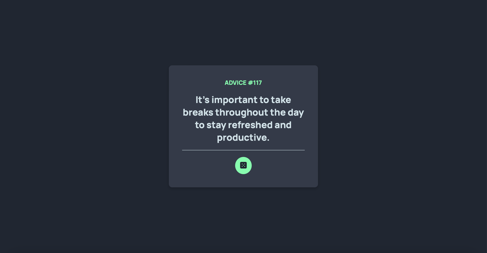
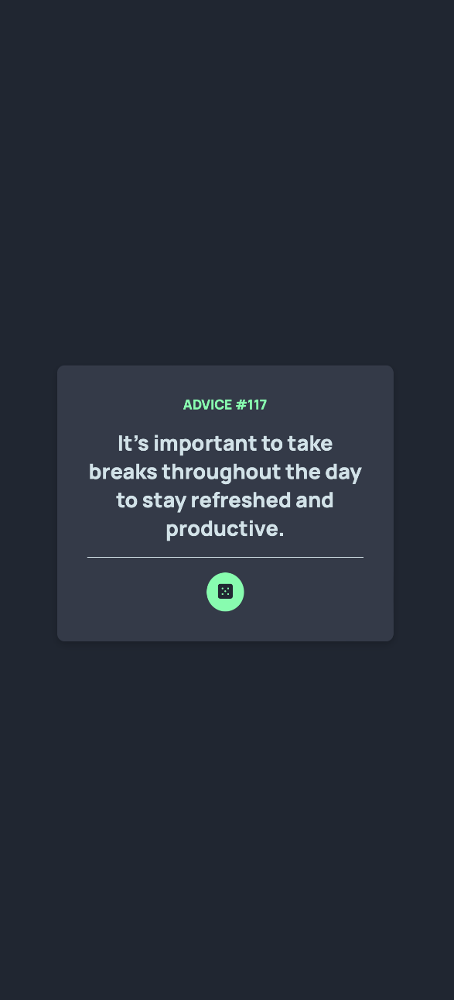

# Advice Generator App

This is a solution to the [Advice Generator App challenge](https://www.frontendmentor.io/challenges/advice-generator-app-QdUG-13db) on Frontend Mentor. The goal of this project was to build an advice generator app that fetches advice from an API and displays it with a nice, responsive UI.

## Table of Contents

- [Overview](#overview)
- [Built With](#built-with)
- [How to Use](#how-to-use)
- [Screenshots](#screenshots)
- [Acknowledgements](#acknowledgements)

## Overview

The Advice Generator App allows users to:

- View the optimal layout for the app depending on their device's screen size.
- See hover states for all interactive elements on the page.
- Generate a new piece of advice by clicking the dice icon.
  
### Screenshots

#### Desktop View:

#### Mobile View:

## Built With

- HTML
- CSS
- JavaScript
- Advice Slip API
- Responsive Design

## How to Use

1. Clone or download the repository to your local machine.
2. Open `index.html` in your browser to view the app.
3. Click the dice icon to generate new advice.

## Acknowledgements

- Thanks to [Frontend Mentor](https://www.frontendmentor.io/) for providing this challenge.
- Thanks to the open-source community for resources that helped me improve my coding skills.
